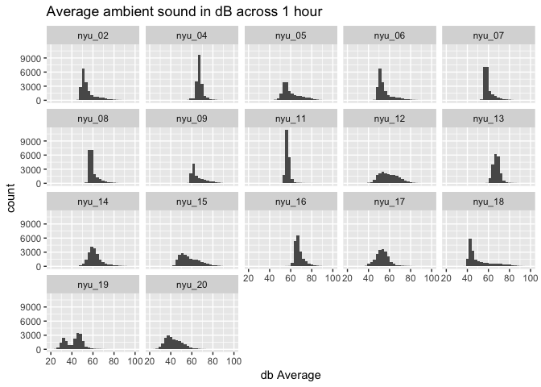
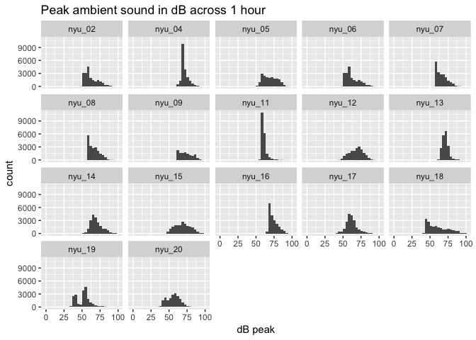

Ambient sound levels: NY pilots
================
Rick O. Gilmore
2017-03-20

Background
----------

This report provides exploratory plots for the ambient sound level measurements collected from the PLAY project pilot sites. Peak and average sound levels (in dB) are collected at 10 Hz, every 100 ms.

Import data and create aggregate data frame
-------------------------------------------

``` r
db.file.list <- list.files(path = csv.dir, pattern = "^nyu", full.names = TRUE)

db.df.list <- lapply(db.file.list, read.csv)

db.aggregate.df <- Reduce(function(x, y) merge(x, y, all=TRUE),
                          db.df.list)
```

Plots
-----

### Histogram of average sound levels by site

``` r
ggplot(data = db.aggregate.df, aes(x=db.avg)) +
  geom_histogram() +
  facet_wrap(facets = c("sub.num")) +
  ggtitle("Average ambient sound in dB across 1 hour") +
  xlab("db Average")
```

    ## `stat_bin()` using `bins = 30`. Pick better value with `binwidth`.



### Histogram of peak sound levels by site

``` r
library(ggplot2)

ggplot(data = db.aggregate.df, aes(x=db.peak)) +
  geom_histogram() +
  facet_wrap(facets = c("sub.num")) +
  ggtitle("Peak ambient sound in dB across 1 hour") +
  xlab("dB peak")
```

    ## `stat_bin()` using `bins = 30`. Pick better value with `binwidth`.

    ## Warning: Removed 6 rows containing non-finite values (stat_bin).


